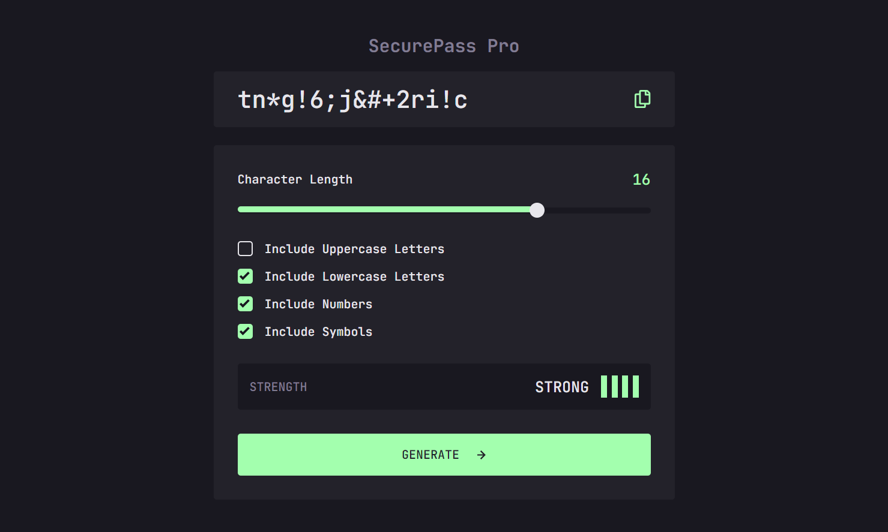

# SecurePass Pro

A modern, secure password generator built with React that helps users create strong passwords with real-time strength analysis.

## 📸 Screenshot



## 🔴 Live Demo

[View Live Demo](https://secure-pass-pro-tawny.vercel.app/)

## 🔍 Overview

SecurePass Pro is a robust password generator that combines security with user experience. It allows users to create customized passwords while providing real-time feedback on password strength.

### Key Features

- Custom password length (5-20 characters)
- Character set options:
  - Lowercase letters
  - Uppercase letters
  - Numbers
  - Special characters
- Real-time password strength indicator
- One-click copy functionality
- Visual feedback for copied passwords
- Mobile-responsive design
- Keyboard-accessible interface

## 🛠️ Tech Stack

- React 18
- Context API for state management
- CSS3 with custom properties
- Vite for build tooling
- Modern JavaScript (ES6+)

## 💡 How to Use

1. Select desired password length using the slider (5-20 characters)
2. Choose character sets to include:
   - Lowercase (a-z)
   - Uppercase (A-Z)
   - Numbers (0-9)
   - Symbols (!@#$%^&\*)
3. Click "Generate" to create a password
4. Use the copy button to save the password to clipboard

### Password Strength Indicators

- Too Weak: Limited character sets, shorter length
- Weak: Basic combination of character sets
- Medium: Good mix of characters and length
- Strong: Optimal length with all character sets

## 🎨 Design & Implementation

### Context API

Used React Context for global state management, handling:

- Password generation logic
- Character set options
- Strength calculations
- Copy functionality

### Styling

- Custom CSS properties for theme consistency
- Mobile-first responsive design
- Smooth transitions and hover states
- Accessible color contrast ratios

### Accessibility Features

- ARIA labels for interactive elements
- Keyboard navigation support
- Visual feedback for all interactions
- Screen reader friendly structure

## 🚀 Setup & Installation

```bash
# Clone repository
git clone https://github.com/KeepSerene/secure-pass-pro-react-js.git

# Install dependencies
npm install

# Run development server
npm run dev

# Build for production
npm run build
```

## 👤 Author

Dhrubajyoti Bhattacharjee

- GitHub: [@KeepSerene](https://github.com/KeepSerene)
- Portfolio: [Dhrubajyoti Bhattacharjee](https://math-to-dev.vercel.app/)
- LinkedIn: [Dhrubajyoti Bhattacharjee](https://www.linkedin.com/in/dhrubajyoti-bhattacharjee-320822318/)

## 📄 License

MIT License - feel free to use and modify for your own projects.
